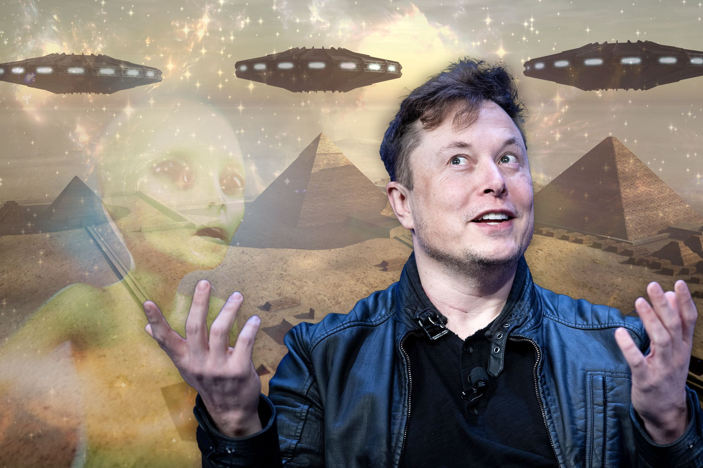

# It's a bird! It's a plane! It's.... Elon Musk (an ET on Earth)..?

## Background and Motivation

Given a collection of UFO sighting reports, we were tasked to gather insights about what was happening with the data. 

A couple of questions we decided to ask about the data: 

- Where were these sightings happening?
- What were the most common things being said in the observations? 

Having seen the movie ET, we thought maybe there would be some mention of bikes, and reeces pieces or the mention of a large head. 

## Data Cleaning

The data was supplied in JSON format, with 4 unique keys: _id (unique citing ID), url (url for the citing), html (html file for the citing), time (timestamp for the citing). The details of each citing were located in the html values for the dictionary and in order to process this we used beautiful soup as follows:

1. Separated the json files by keys into 4 separate lists, one for each key, containing all the values corresponding to the key for each record.

2. Utilizing BeautifulSoup to 'prettify' the file into a more readable format, we sifted through the html file to locate the important 

3.

## EDA

## Analysis

We made a wordcloud using the Wordnet Lemmatizer to see what the most common words in the sightings were:

We created a wordcloud from the features extracted usint the Sklearn TFIDF Vectorizer as well and got different results:

## Conculsions

## Further Work

